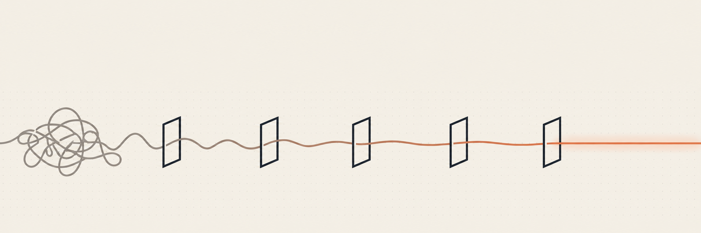

<p align="center">
  <picture>
    <source media="(prefers-color-scheme: dark)" srcset="docs/assets/hero-dark.png">
    
  </picture>
</p>

<h1 align="center">easyClaude</h1>

<p align="center">
  เวิร์กโฟลว์สำหรับ Claude Code ที่เดินครบลูป ตั้งแต่วางแผน ลงมือ ตรวจ จนถึง ship
</p>

<p align="center">
  <a href="README.md"><kbd>English</kbd></a>
  <kbd><b>ภาษาไทย</b></kbd>
</p>

<p align="center">
  <a href="https://github.com/kotaraa09/easyClaude/actions/workflows/validate.yml"></a>
  <a href="LICENSE"></a>
  
  
</p>

---

## นี่คืออะไร

easyClaude เป็นเวิร์กโฟลว์ ไม่ใช่ฟีเจอร์เดี่ยว ๆ มันวางลูปที่ปกติคุณต้องเดินเองทุกครั้งเอาไว้ให้ คือเขียนแผน ลงมือทำทีละก้อน ตรวจว่าใช้ได้จริง บันทึกว่าเปลี่ยนอะไรไป แล้ว commit

คุณบอกสิ่งที่ต้องการด้วยภาษาคนธรรมดา แต่ละขั้นจะเริ่มเพราะขั้นก่อนหน้าจบแล้ว และไม่มีอะไรถูกนับว่าเสร็จจนกว่าการตรวจจะผ่าน

มีสี่อย่างที่ได้มาด้วย

**ตัวเวิร์กโฟลว์เอง** ความจำที่ข้ามเซสชันได้ ประตูตรวจงานที่ไม่ยอมให้บอกว่า "เสร็จ" ตอนที่ build ยังแดง คำสั่งอันตรายที่ถูกบล็อกตั้งแต่ชั้น permission และขั้นตอน git (แตกแบรนช์ รีวิว commit เปิด PR) ที่ทำเองอัตโนมัติได้เมื่อคุณเปิดใช้

**การหาไลบรารีก่อนจะลงมือเขียนเอง** เขียนตัวแปลงวันที่เองแปลว่าต้องตามแก้บั๊กไปตลอด มันจะไปดูว่าวงการเขาลงตัวกับตัวไหน แล้วตรวจความปลอดภัยของแพ็กเกจก่อนเสนอให้

**โหมดประหยัด** คำสั่งเดียวสำหรับตอนเครดิตเหลือน้อย ใช้โมเดลที่ถูกกว่า ให้วิธีแก้ที่เล็กที่สุดที่ใช้งานได้ พร้อมบอกว่าข้ามอะไรไปบ้าง

**การเชื่อมต่อสิ่งที่ Claude ทำเองไม่ได้** ตั้งค่า MCP server จากแบบฟอร์มเดียว และส่งงานสร้างรูป เสียง และ 3D ต่อให้บริการที่สร้างไฟล์ออกมาได้จริง

มันจะไม่สร้างโปรเจกต์ให้ ไม่เลือกเครื่องมือให้ และไม่เขียนโค้ดตั้งต้นให้ มันทำงานคู่ไปกับสิ่งที่คุณทำอยู่แล้ว บนสแตกไหนก็ได้

## เหมาะกับเราไหม

คุ้มถ้าคุณทำโปรเจกต์ที่ต้องกลับมาทำต่อหลายวัน โดยเฉพาะถ้าคุณเพิ่งเริ่มเขียนโปรแกรมและอยากมีตัวกันพลาดไว้

อาจไม่คุ้มถ้าคุณใช้ Claude Code แค่ถามอะไรสั้น ๆ หรือขอโค้ดทีละชิ้น เพราะจะกลายเป็นจ่ายค่าใช้จ่ายประจำให้กับสิ่งที่ไม่ได้ใช้

## ติดตั้ง

เปิดเทอร์มินัลในโปรเจกต์ไหนก็ได้

```bash
claude
```

แล้วพิมพ์สองบรรทัดนี้ลงใน Claude Code

```
/plugin marketplace add kotaraa09/easyClaude
/plugin install easyclaude@easyclaude
```

เท่านี้ก็จบ เปิดโปรเจกต์แล้วเริ่มคุยกับมันได้เลย ถ้ามันยังไม่รู้จักโปรเจกต์นี้ มันจะบอกคุณเองและเสนอตัวจัดการให้

<details>
<summary><b>อยากเริ่มจากเทมเพลตมากกว่า</b></summary>

<br>

fork [`template/`](template/) ไปแทน ข้างในชี้ไปที่ปลั๊กอินใน `.claude/settings.json` ให้เรียบร้อยแล้ว คนที่ clone repo ของคุณจึงข้ามขั้นตอนติดตั้งไปได้เลย แค่กดยอมรับ trust prompt ตอนเปิด Claude Code ครั้งแรก

</details>

## ครั้งแรกที่รัน

**มันจะถามไม่กี่ข้อ** มากสุดสี่ข้อ ด้วยภาษาที่เข้าใจง่าย ว่าคุณกำลังทำอะไร ทำให้ใคร ที่เหลือมันดูเอาจากไฟล์ในโปรเจกต์ และจะไม่ถามสิ่งที่มันหาเองได้

**มันจะจดสิ่งที่รู้เอาไว้** จะมีไฟล์เล็ก ๆ ไม่กี่ไฟล์โผล่มาใน `docs/` ไฟล์ที่สำคัญคือ `docs/STATE.md` ซึ่งเก็บว่างานไหนกำลังทำอยู่ งานไหนเป็นงานถัดไป และติดอะไรค้างไว้บ้าง

**หลังจากนั้น ทุกครั้งที่เปิดเซสชันใหม่จะขึ้นแบบนี้**

```
Now:     เพิ่มระบบรีเซ็ตรหัสผ่านในหน้าล็อกอิน
Next:    จำกัดจำนวนครั้งที่เรียก endpoint รีเซ็ตรหัสผ่าน
Blocked: ไม่มี
Debt:    3 รายการ - token รีเซ็ตรหัสผ่านไม่มีวันหมดอายุ
```

สามบรรทัด แล้วมันก็รอ ไม่มีการสรุปโค้ดทั้งโปรเจกต์ ไม่ต้องไล่อ่านใหม่ทั้งหมด พิมพ์ว่า "ทำต่อ" แล้วมันจะทำต่อจากตรงนั้น

บรรทัดที่สี่จะขึ้นเฉพาะตอนมีงานที่ตั้งใจข้ามไว้ และจะบอกรายการที่น่าจะสร้างปัญหาที่สุด งานที่ข้ามไว้แล้วไม่มีใครกลับมาอ่านอีก ก็คือการลืมแบบช้า ๆ เท่านั้นเอง<!--skill:kickoff-->

## สิ่งที่คุณจะได้

<table>
<tr>
<td width="33%" valign="top">

<h3>มันจำได้</h3>
<p>งานที่กำลังทำ งานถัดไป สิ่งที่ติดอยู่ และสิ่งที่ตั้งใจข้ามไป อยู่ใน <code>docs/STATE.md</code> ทั้งหมด ปิดเครื่องไปแล้วก็ไม่หาย งานที่เสร็จแล้วจะถูกย้ายไป changelog เพื่อให้ไฟล์นี้สั้นอยู่เสมอ</p>
</td>
<td width="33%" valign="top">

<h3>"เสร็จ" แปลว่าตรวจแล้ว</h3>
<p>ตอนตั้งค่า มันจะหาว่าโปรเจกต์ของคุณต้องรันคำสั่งอะไรถึงจะถือว่าผ่าน จากนั้น Claude จะจบเทิร์นไม่ได้ถ้ายังมีคำสั่งไหนไม่ผ่าน มันจะถูกส่งกลับไปแก้ ตัวตรวจนี้เป็นสคริปต์ที่อ่าน exit code ไม่ใช่ Claude ตรวจการบ้านตัวเอง คำสั่งที่ช้าตั้งเป็น <code>tier: full</code> ได้ ให้รันตอนจบงานและตอน ship แทนที่จะรันทุกเทิร์น</p>
</td>
<td width="33%" valign="top">

<h3>คำสั่งอันตรายถูกบล็อก</h3>
<p><code>rm -rf</code>, force push, hard reset, การดึงสคริปต์จากเน็ตมารันตรง ๆ และอะไรก็ตามที่แตะ <code>.env</code> ถูกปฏิเสธที่ชั้น permission ตั้งแต่แรก Claude ไม่มีสิทธิ์เลือก</p>
</td>
</tr>
<tr>
<td width="33%" valign="top">

<h3>มันมองหาไลบรารีก่อน</h3>
<p>เขียนตัวแปลงวันที่เองแปลว่าต้องตามแก้บั๊กไปตลอด และคุณเป็นคนจ่าย มันเลยไปดูว่าคนอื่นเขาใช้อะไรกัน แล้วตรวจความปลอดภัยก่อนเสนอให้</p>
</td>
<td width="33%" valign="top">

<h3>โหมดประหยัด</h3>
<p><code>/easyclaude:cheap</code> จะให้วิธีแก้ที่เล็กที่สุดที่ใช้งานได้ บนโมเดลที่ถูกกว่า พร้อมบอกว่าข้ามอะไรไปบ้าง แล้วมันจะปิดตัวเองหลังจบเทิร์น</p>
</td>
<td width="33%" valign="top">

<h3>มันรู้จักสแตกของคุณ</h3>
<p>มีสิบสแตกที่มาพร้อมสูตรสำเร็จ ว่าจะตรวจ build อย่างไรและอะไรมักพัง ถ้าเป็นอย่างอื่น มันจะถามคุณแล้วเขียนสูตรใหม่ให้</p>
</td>
</tr>
</table>

## แค่บอกว่าอยากได้อะไร

เรื่องที่ใช้บ่อยไม่มีคำสั่งให้ต้องจำ พูดออกมาเป็นภาษาคนได้เลย จะพิมพ์ไทยหรืออังกฤษก็ได้

| คุณพิมพ์ | สิ่งที่เกิดขึ้น |
|---|---|
| *"เพิ่มระบบโปรไฟล์ผู้ใช้"* | เขียนแผนกับรายการงานให้ก่อน แล้วรอให้คุณตอบตกลง <!--skill:plan-feature--> |
| *"ทำต่อ"* | ทำงานชิ้นถัดไป แล้วตรวจให้ <!--skill:build-task--> |
| *"มันขึ้น error"* | ทำให้เกิดซ้ำ แก้ แล้วทิ้งเทสไว้กันไม่ให้กลับมาอีก <!--skill:debug--> |
| *"ship เลย"* | ตรวจ แตกแบรนช์ รีวิว commit แล้วเปิด pull request <!--skill:ship--> |
| *"ระบบล็อกอินอยู่ตรงไหน"* | มันค้นก่อนอ่าน แล้วบอกว่าเจออะไร <!--skill:explore-code--> |

งานเล็ก ๆ ข้ามขั้นตอนพวกนี้ทั้งหมด แก้บั๊กบรรทัดเดียวก็คือแก้บั๊กบรรทัดเดียว

<details>
<summary><b>รายการคำสั่ง สำหรับคนที่อยากใช้</b></summary>

<br>

มีงานหกอย่างที่นาน ๆ ใช้ที ก็เลยไม่ได้เปิดรอฟังอยู่เบื้องหลัง คุณเรียกมันด้วยชื่อเมื่อต้องการ และมันไม่กินค่าใช้จ่ายอะไรจนกว่าจะถูกเรียก และนี่คือเหตุผลที่มันไม่อยู่ในตารางข้างบน สกิลที่ไม่กินค่าใช้จ่ายต่อเทิร์น คือสกิลที่ไม่ได้เปิดรอฟังประโยคใด ๆ อยู่

```
/easyclaude:write-tests        เริ่มชุดเทส ให้ประตูตรวจถึงพฤติกรรมด้วย
/easyclaude:rescue             ย้อนสิ่งที่ทำไป เอางานกลับคืนมา
/easyclaude:security-check     ไล่ตรวจ secret, ประวัติ git, endpoint, dependency
/easyclaude:deploy             พิสูจน์ว่า build ผ่าน เลือกโฮสต์ ตรวจ URL จริง
/easyclaude:generate-asset     รูป เสียง 3D
/easyclaude:pick-library       หาไลบรารีที่ผ่านการตรวจแล้ว แทนการเขียนเอง
```

อีกเจ็ดคำสั่งใช้ควบคุมตัว easyClaude เอง

```
/easyclaude:start              สั่งตั้งค่าเอง ถ้ามันไม่ได้เริ่มให้เอง
/easyclaude:cheap <งาน>        ประหยัดหนึ่งเทิร์น แล้วกลับสู่ปกติ
/easyclaude:cheap-session      ประหยัดต่อเนื่องจนกว่าคุณจะสั่งเลิก
/easyclaude:full               กลับสู่ปกติ
/easyclaude:connect            เชื่อมเครื่องมืออื่น (Figma, GitHub, ฐานข้อมูล)
/easyclaude:autoship           ให้มัน commit หรือ ship เองได้ ปิดไว้เป็นค่าเริ่มต้น
/easyclaude:skills             ดูรายการสกิลจากที่อื่น แล้วติดตั้งตัวที่เลือก
```

</details>

## สร้างรูป เสียง และ 3D

Claude วาดรูป อัดเสียง หรือปั้นโมเดลไม่ได้ easyClaude เลยส่งงานพวกนี้ต่อให้บริการที่ทำได้

```bash
node scripts/gen/generate.mjs --kind image --prompt "..." --out public/hero.webp
node scripts/gen/generate.mjs --list      # มีอะไรให้ใช้บ้าง และอันไหนผ่านการทดสอบแล้ว
node scripts/gen/generate.mjs --check     # พิสูจน์ว่าคีย์ใช้ได้ โดยไม่สร้างไฟล์
```

หรือจะเรียก `/easyclaude:generate-asset` แล้วให้มันจัดการเองก็ได้

คีย์ไหนที่คุณมีอยู่แล้ว มันก็ใช้ตัวนั้น Replicate ครอบคลุมทุกประเภทด้วยคีย์เดียว ElevenLabs ทำเสียงพูดและเสียงประกอบ OpenAI, Gemini และ Venice ทำรูป ส่วน `--provider local` สั่ง Automatic1111 หรือ ComfyUI บนเครื่องคุณเอง ซึ่งไม่มีค่าใช้จ่ายต่อรูป

เรื่องที่ต้องระวัง การสมัครแบบรายเดือนไม่เท่ากับ API key ChatGPT Plus, Gemini Advanced, Copilot และ NotebookLM ไม่ได้รวมสิทธิ์ใช้ API มาด้วย นั่นเป็นคนละบัญชีและคนละบิล

ทุกครั้งที่สร้างจะถูกบันทึกลง `docs/asset-log.md` เพราะมันเสียเงินจริงและไม่เหลือร่องรอยอย่างอื่น มันจะถามก่อนใช้เงิน และถ้าไม่แน่ใจจะถอยไปใช้ `--dry-run`

จุดอ่อนที่ควรรู้ โมเดลสร้างภาพแบบ raster ใช้ได้ดีกับภาพชั่วคราว พื้นหลัง เท็กซ์เจอร์ และการวางอารมณ์ แต่ทำโลโก้จริงไม่ได้ เพราะผลลัพธ์แค่ดูเหมือนโลโก้เท่านั้น ถ้าต้องการเวกเตอร์จริง ๆ ใช้ `--model recraft-ai/recraft-v3-svg`

<details>
<summary><b>ทำไมเลือกผู้ให้บริการเหล่านี้</b></summary>

<br>

ผู้ให้บริการต้องทำสิ่งที่ Claude ทำเองไม่ได้ กฎข้อนี้ตัด Ollama, DeepSeek, Kimi และ OpenRouter ออก เพราะทั้งหมดทำได้แค่ข้อความ ส่วน Midjourney ไม่ผ่านเพราะไม่มี API อย่างเป็นทางการ เหตุผลพวกนี้เขียนไว้ใน `providers.mjs` เพื่อให้กฎอยู่ต่อได้แม้เปลี่ยนคนดูแล

`--list` บอกว่าอะแดปเตอร์แต่ละตัวเคยสร้างชิ้นงาน **ชนิดไหน** ได้จริงบ้าง ไม่ใช่แค่ว่าผู้ให้บริการใช้งานได้หรือไม่ จนถึงตอนนี้มีแค่ Replicate และเฉพาะภาพเท่านั้น ส่วนเส้นทางวิดีโอ เสียง และ 3D นั้นเขียนไว้แล้วแต่ยังไม่เคยพิสูจน์

คีย์ถูกอ่านอยู่ภายในสคริปต์และไม่เคยเข้าไปอยู่ใน context ของ Claude นี่คือเหตุผลที่มันเป็นสคริปต์ธรรมดาแทนที่จะเป็น MCP server ไม่มี tool schema ถูกโหลดทุกเทิร์น และรันใน CI ได้

</details>

## เชื่อมต่อเครื่องมืออื่น

เป็นของเสริม ไม่จำเป็นต่อการเขียนโปรแกรม ที่มีไว้เพราะการตั้งค่า MCP server ด้วยมือนั้นจุกจิก และเวลาพังก็มักไม่รู้ว่าพังตรงไหน

`/easyclaude:connect` เปลี่ยนเรื่องนี้ให้เหลือแค่กรอกแบบฟอร์ม `.env.example` มีรายชื่อทุกตัวพร้อมคำอธิบายบรรทัดเดียวและที่ไปเอาคีย์ กรอกเฉพาะตัวที่คุณมี ช่องที่เว้นว่างจะปิดอยู่ และไม่มีอะไรต้องมาถอนออกทีหลัง

มีสามตัวที่ไม่ต้องใช้คีย์เลย และสามตัวนี้คือตัวที่ควรรู้จัก **playwright** ขับเบราว์เซอร์จริง เพื่อให้ Claude กดใช้งานสิ่งที่มันสร้างแทนการเดาว่ามันทำงาน **inspo** ค้นหาเว็บไซต์จริงกว่า 800 แห่งเพื่อใช้อ้างอิงงานออกแบบ ซึ่งใช้คู่กับสกิลออกแบบที่ `/easyclaude:skills` ติดตั้งไว้ได้ดี เพราะสกิลสองตัวนั้นไม่มีตัวอย่างมาให้ **graft** ทำแผนโค้ดของคุณเอง

```bash
node scripts/connect.mjs --list      # มีอะไรให้ใช้บ้าง
node scripts/connect.mjs --status    # คีย์ไหนถูกกรอกแล้ว บอกแค่ชื่อ ไม่บอกค่า
node scripts/connect.mjs --apply     # ตั้งค่าทุกตัวที่มีคีย์
```

คีย์ของคุณไม่เคยเข้าไปอยู่ใน context ของ Claude `.env` ถูกบล็อกทั้งการอ่านและการเขียน สคริปต์จึงเป็นคนเปิดอ่านเอง แล้วรายงานกลับมาแค่ว่าเจอชื่อคีย์อะไรบ้าง

และคีย์ก็ไม่เคยไปอยู่ในบรรทัดคำสั่งด้วย `claude mcp add` รับคีย์ได้ทางอาร์กิวเมนต์เท่านั้น ซึ่งโปรเซสอื่นที่รันด้วยสิทธิ์เดียวกับคุณอ่านได้ สคริปต์จึงส่งค่าแทนที่แบบใช้ครั้งเดียวไปก่อน แล้วค่อยเขียนค่าจริงลงไฟล์ตั้งค่าทีหลัง

<details>
<summary><b>แต่ละตัวไปลงที่ไหน และทำไม</b></summary>

<br>

| ตัวเชื่อมต่อ | ไปลงที่ | เหตุผล |
|---|---|---|
| ไม่ต้องใช้คีย์ | `.mcp.json` ซึ่ง commit ไปด้วย | เพื่อนร่วมทีมได้ไปด้วย และ Claude Code จะค้างไว้ที่สถานะรออนุมัติจนกว่าคนจะกดรับ |
| ต้องใช้คีย์ | `~/.claude.json` ซึ่งอยู่นอก repo | คีย์จะถูก commit โดยไม่ตั้งใจไม่ได้ |

บางตัวทำอัตโนมัติไม่ได้เลย Figma, Notion, Linear, Slack, Atlassian, Sentry และ Higgsfield ล็อกอินผ่านเบราว์เซอร์และไม่มีคีย์ให้วาง จึงต้องใช้ขั้นตอน `/mcp` แบบโต้ตอบ สคริปต์จะไล่ชื่อพวกนี้ให้ คุณจะได้รู้ว่าต้องไปทำเองตัวไหนบ้าง

Higgsfield เป็นตัวเดียวในกลุ่มนี้ที่สร้างงานได้ คือรูปและวิดีโอ ผ่าน Sora, Veo, Kling และอื่น ๆ สคริปต์จะพิมพ์คำสั่งสำหรับเพิ่มมันให้ครบ เพราะ `/mcp` ล็อกอินเข้าเซิร์ฟเวอร์ได้ แต่เพิ่มเซิร์ฟเวอร์ใหม่ไม่ได้ มันถูกแยกออกจากชุดที่ติดตั้งอัตโนมัติโดยตั้งใจ ทุกครั้งที่สร้างงานจะหักเครดิตจากบัญชี Higgsfield ของคุณ มันจึงถูกเก็บไว้เป็นของคุณคนเดียว และไม่เข้าไปอยู่ใน `.mcp.json` ที่แชร์กับคนอื่น

`enableAllProjectMcpServers` ถูกเว้นไว้ไม่ใส่ในไฟล์ตั้งค่าทุกไฟล์ที่นี่โดยตั้งใจ มันอนุมัติทุก server ใน `.mcp.json` ที่ commit มาให้อัตโนมัติ ซึ่งแปลว่าการ clone repo หนึ่งอาจรันอะไรก็ตามที่คนแปลกหน้าใส่ไว้โดยที่คุณไม่รู้ตัว ประตูอนุมัตินั้นคือสิ่งที่ทำให้การ commit `.mcp.json` ปลอดภัยตั้งแต่แรก

</details>

<details>
<summary><b>Graft และเหตุผลที่ต่อไว้แค่ครึ่งเดียว</b></summary>

<br>

[Graft](https://github.com/trailhq/Graft) สร้างแผนที่ของ codebase ของคุณเอง ว่าอะไรเรียกอะไร อะไรอยู่ตรงไหน Claude จึงเปิดดูได้ตรง ๆ แทนที่จะไล่อ่านไฟล์ไปเรื่อย ๆ กว่าจะเจอ มันเป็น MIT ยังพัฒนาต่อเนื่อง และไม่ต้องใช้คีย์ `/easyclaude:connect` จึงเสนอมันเหมือน connector ตัวอื่นที่ไม่ต้องใช้คีย์

เราต่อไว้แค่ตัว MCP server และมันปิดอยู่จนกว่าคุณจะขอ นี่เป็นการตัดสินใจเรื่องค่าใช้จ่าย ไม่ใช่ความไม่มั่นใจในตัวเครื่องมือ

schema ของ tool ทั้งหกตัวของ Graft รวมกับข้อความ MCP instructions วัดได้ราว 1,095 token ต่อเทิร์น ด้วยกฎ chars/4 เดียวกับที่ `scripts/validate.mjs` ใช้วัดทุกอย่างในนี้ ส่วนตัวเฟรมเวิร์กเองวัดได้ 958 การเปิด Graft ไว้เป็นค่าเริ่มต้นจะทำให้ค่าใช้จ่ายประจำของทุกเทิร์นในทุกเซสชันเพิ่มขึ้นเกือบเท่าตัว รวมถึงเทิร์นที่ไม่ได้แตะกราฟเลย และป้ายที่หัวหน้านี้ก็จะไม่จริงอีกต่อไป

ที่แย่กว่านั้นคือ ตัวตรวจงบจะไม่รู้เรื่องด้วยซ้ำ มันนับแค่ `rules/*.md` คำอธิบายของ skill และคำอธิบายของ agent ส่วน schema ของ MCP tool ไม่ใช่สักอย่างในนั้น ตัวเลขเดียวที่ CI เฝ้าอยู่จึงมองไม่เห็นสิ่งที่ใหญ่ที่สุดที่จะขยับมันได้ นี่คือเหตุผลจริง ๆ ที่ `.mcp.json` ส่งมาว่างเปล่า เมื่อประตูตรวจป้องกันพื้นที่ตรงนี้ไม่ได้ ค่าเริ่มต้นจึงต้องเป็นตัวป้องกันแทน

`graft init` เป็นขั้นที่สองแยกต่างหาก และเราไม่รันให้คุณ มันเขียน hook ลงที่ `SessionStart` และ `Stop` ซึ่งเป็นสองเหตุการณ์เดียวที่ easyClaude ใช้ ตัว SessionStart ของมันจะส่งบล็อกแนะนำโครงสร้าง repo เข้ามาในเทิร์นแรกเทิร์นเดียวกับที่ `hooks/hooks.json` กันไว้ให้ข้อความเปิดสี่บรรทัด ทั้งที่คำสั่งของข้อความเปิดเขียนไว้ว่า "และไม่มีอะไรอื่น" นอกจากนี้มันยังติดตั้ง statusline และไฟล์ `.claude/skills/graft/SKILL.md` ด้วย ถ้าคุณอยากได้ส่วนนั้น ให้รันเอง โดยรู้ตัว ไม่ใช่ได้มาโดยปริยาย

มีสองเรื่องที่ต้องรู้ก่อนเปิดใช้:

- tool ของมันจะไม่คืนอะไรเลยจนกว่าจะมีกราฟ ให้รัน `npx -y @nanonets/graft@0.16.0 build` หนึ่งครั้งในโปรเจกต์ เพิ่ม `graft/` ลง `.gitignore` แล้ว build ใหม่หลังแก้ครั้งใหญ่ ตัว connector จะพิมพ์ขั้นตอนนี้ให้ตอนคุณเพิ่มมัน
- มันส่งข้อมูลการใช้งานแบบไม่ระบุตัวตนหนึ่งครั้ง ตั้ง `DO_NOT_TRACK=1` เพื่อปิด คำสั่ง `build` ปกติทำงานในเครื่องด้วย tree-sitter ไม่เรียกโมเดล มีแค่ `build --deep` ที่เรียก LLM และตัวนั้นมีค่าใช้จ่าย

เวอร์ชันถูกปักไว้ connector ที่วิ่งตาม `latest` คือโค้ดที่ยังไม่มีใครตรวจแล้ววิ่งมาลงเครื่องคุณ ด้วยเหตุผลเดียวกับที่ `skills/registry.json` ปักทุก skill ที่ vendor มาไว้ที่ commit เดียว

</details>

## ให้มัน ship เองอัตโนมัติ

ปิดไว้จนกว่าคุณจะเปิด `/easyclaude:autoship` จะเริ่มจากตรวจก่อนว่า git ใช้งานได้จริงหรือเปล่า ตั้งชื่อผู้ใช้ไว้แล้วไหม มี remote ไหม ติดตั้งและล็อกอิน `gh` แล้วหรือยัง และคุณมีสิทธิ์เขียนหรือเปล่า จากนั้นจึงเสนอเฉพาะระดับที่ทำได้จริง

| ระดับ | เพิ่มอะไร | แลกกับอะไร |
|---|---|---|
| `commit` | แตกแบรนช์ รีวิว diff ตัวเอง แล้ว commit | ไม่มาก commit ที่ไม่ดีก็ revert ครั้งเดียวจบ |
| `push` | แบรนช์ออกจากเครื่องคุณ | ตอนนี้มันไปอยู่ในที่ที่คนอื่นเห็นแล้ว |
| `pr` | เปิด pull request | |
| `merge` | merge แล้วซิงก์ base ในเครื่องให้ | จุดที่คนตรวจเป็นจุดสุดท้าย |

มันจะทำงานก็ต่อเมื่อฟีเจอร์หนึ่งเสร็จทั้งก้อน คือทุกการตรวจผ่าน และไม่เหลืออะไรค้างใต้ `Now`, `Next` หรือ `Blocked` บั๊กที่เจอระหว่างทำงานจะถูกใส่ไว้ใต้ `## Next` ซึ่งแค่นั้นก็พอที่จะหยุดการ ship แล้ว การผูกกันแบบนี้ตั้งใจให้เป็นอย่างนั้น เพราะ "เจออะไรบางอย่าง" กับ "อันนี้เสร็จแล้ว" มักเป็นจังหวะเดียวกัน

มันจะปฏิเสธไม่ว่าคุณตั้งค่าไว้อย่างไร ถ้าการตรวจไม่ผ่าน ถ้าการแก้ไปแตะระบบล็อกอิน การจ่ายเงิน หรือการย้ายโครงสร้างฐานข้อมูล หรือถ้าโหมดประหยัดเปิดอยู่ ค่าตั้งอยู่ใน `.claude/autoship.json` ซึ่งถูก gitignore ไว้ เพราะการอนุญาตนี้เป็นของคุณ ไม่ใช่ของ repo

## คำถามที่เจอบ่อย

<details>
<summary><b>ต้องจำคำสั่งอะไรไหม</b></summary>

<br>

ไม่ต้อง ทุกอย่างในตารางข้างบนทำงานจากภาษาพูดธรรมดา ส่วนคำสั่งต่าง ๆ มันจะบอกคุณเองตอนที่ถึงเวลาต้องใช้จริง ๆ

</details>

<details>
<summary><b>ถ้าประตูตรวจงานไม่ยอมให้ Claude จบสักที</b></summary>

<br>

มันขังคุณไม่ได้ Claude Code นับจำนวนครั้งที่เทิร์นถูกบล็อกติดต่อกัน แล้วจะข้ามประตูให้เองหลังจากไม่กี่ครั้ง การตรวจที่ไม่มีทางผ่านจึงยอมแพ้ก่อนที่จะทำให้เซสชันของคุณค้าง ถ้าอยากให้เข้มกว่านี้ ตั้งค่า `CLAUDE_CODE_STOP_HOOK_BLOCK_CAP` ให้สูงขึ้น

</details>

<details>
<summary><b>มันจะ commit หรือ push เองโดยไม่ถามไหม</b></summary>

<br>

จะเกิดขึ้นก็ต่อเมื่อคุณเปิดเองด้วย `/easyclaude:autoship` และเมื่อเปิดอยู่ ทุกเซสชันจะขึ้นบรรทัดบอกคุณตั้งแต่ต้น คุณไม่ควรต้องมานั่งเดาว่าเซสชันนี้ push แทนคุณได้หรือเปล่า

</details>

<details>
<summary><b>มันรับประกันได้จริงหรือว่าโค้ดใช้งานได้</b></summary>

<br>

ขึ้นอยู่กับสแตกของคุณ และมันจะบอกคุณเองว่าคุณอยู่ในกรณีไหน

โปรเจกต์เว็บ, Python, Go, Rust และโปรแกรมบรรทัดคำสั่ง ตรวจได้จริง ส่วน Unity, Unreal, Android Studio และ iOS มักตรวจไม่ได้ถ้าไม่มีหน้าจอ กรณีพวกนี้มันพิสูจน์ได้แค่ว่าโค้ดคอมไพล์ผ่าน แต่ไม่ได้แปลว่าทำงานถูก และมันจะบอกคุณตรง ๆ แทนที่จะทำเป็นรับประกันในสิ่งที่ให้ไม่ได้

</details>

<details>
<summary><b>ใช้กับโปรเจกต์ที่เริ่มไปแล้วได้ไหม</b></summary>

<br>

ได้ มันจะเห็นว่ามีโค้ดอยู่แล้ว ข้ามคำถามที่หาคำตอบเองได้จากไฟล์ และถามเฉพาะสิ่งที่โค้ดบอกไม่ได้ เช่น โปรเจกต์นี้ทำให้ใคร และคุณอยากทำอะไรต่อ

</details>

<details>
<summary><b>ถ้าอยากเอาออก ทำอย่างไร</b></summary>

<br>

`/plugin uninstall easyclaude@easyclaude` ส่วนไฟล์ที่มันเขียนไว้ใน `docs/` เป็นไฟล์ markdown ธรรมดา จะเก็บไว้หรือลบทิ้งก็ได้ ไม่มีอะไรซ่อนไว้ที่อื่น

</details>

## ค่าใช้จ่าย

easyClaude ไม่ได้ใช้ฟรี และโปรเจกต์ที่พูดเรื่องค่าโทเคนตลอดก็ไม่ควรพูดกำกวมเรื่องค่าใช้จ่ายของตัวเอง

ชื่อและคำอธิบายของทุกสกิลถูกส่งไปทุกเทิร์นของทุกเซสชัน ไม่ว่าคุณจะใช้มันหรือไม่

<!--cost:958,463,438,57-->**ราว 958 โทเคนต่อเทิร์น** แบ่งเป็นกฎราว 463 คำอธิบายสกิลราว 438 และคำอธิบายเอเจนต์ราว 57 ส่วนเนื้อสกิลกับสูตรของแต่ละสแตกอีกราว 3.4k นั้นจะโหลดเฉพาะตอนที่มีอะไรเรียกใช้จริง

คิดคร่าว ๆ คือข้อความประมาณหนึ่งหน้าต่อเทิร์น ถ้ามากเกินกว่าที่อยากจ่าย ใช้ `/easyclaude:cheap`

<details>
<summary><b>ตัวเลขนี้ถูกคุมไว้อย่างไร</b></summary>

<br>

สกิลถูกแยกตามความถี่ที่ถูกเรียก <!--always-on:7-->มีเจ็ดตัวที่เปิดค้างไว้เพื่อให้สั่งงานด้วยภาษาพูดได้ คือหกตัวที่ทำงานตลอดเวลา (kickoff, plan-feature, build-task, debug, ship, explore-code) บวกกับ slopmonster ที่หยิบมา ราว 59 โทเคน ซึ่งเป็นสิ่งที่ทำให้ประโยคอย่าง "นี่มันอ่านเหมือน AI เขียนไหม" ไปถึงมันได้ ก่อนหน้านี้ช่องนั้นเป็นสกิลออกแบบที่หยิบมา ราว 156 โทเคน จนถึงเดือนกันยายน 2026 มันถูกเอาออกเพราะมันเลือกรสนิยมให้ทุกโปรเจกต์ที่ติดตั้งมัน ตอนนี้ `/easyclaude:skills` จะถามแทน คุณควรรู้ว่าตอนนี้คุณจ่าย 59 โทเคนต่อเทิร์นให้ตัวตรวจคำ ไม่ว่าโปรเจกต์จะมีงานเขียนหรือไม่

ส่วนอีกหกตัวที่นาน ๆ ใช้ทีตั้งค่า `disable-model-invocation` ซึ่งตัดออกจากค่าใช้จ่ายต่อเทิร์นทั้งหมด เพราะฟังก์ชันคิดต้นทุนของ Claude Code เองมองแบบนั้น เหลือแค่บรรทัดเดียวไว้ชี้ทาง รวมทั้ง `/easyclaude:skills` ด้วย ราว 76 โทเคน เทียบกับราว 424 ถ้าโหลดหกตัวนั้นเต็ม ๆ

เอเจนต์ที่ส่งมามีตัวเดียว และมันกินราว 57 โทเคนต่อเทิร์นด้วยเหตุผลเดียวกับสกิล คือชื่อกับคำอธิบายของมันอยู่ในรายการเครื่องมือทุกเทิร์น ไม่ว่าคุณจะเรียกใช้หรือไม่ `easyclaude-diff-reviewer` คือสายตาคู่ใหม่ในขั้นที่ 3 ของ `ship` มันอ่าน diff ที่ตัวเองไม่ได้เขียน และรายงานเฉพาะสิ่งที่พัง มันถือแค่ `Read` `Glob` และ `Grep` ไม่มีอะไรที่เขียนไฟล์หรือรันคำสั่งได้ เพราะผู้ตรวจที่แก้สิ่งที่ตัวเองเจอ จะดันโค้ดที่ไม่มีใครตรวจผ่านประตูไป ก่อนหน้านี้ขั้นตอนตรวจก็ทำงานอยู่แล้วโดยใช้ผู้ช่วยทั่วไปตัวไหนก็ได้ที่มี การตั้งชื่อมันคือสิ่งที่ซื้อสิทธิ์อ่านอย่างเดียวและโมเดลที่ถูกลงมาให้

CI คุมเพดานนี้ไว้ `skills/registry.json` เป็นคนกำหนด ตัวตรวจสอบคำนวณตัวเลขจริงด้วยสูตรเดียวกับที่ binary ใช้ และ build จะพังถ้าตัวเลขเกิน ตอนนี้เหลืออยู่ราว 442 โทเคน ที่ว่างนี้มาจากสองการเปลี่ยนแปลง และทั้งคู่ควรเอาไปใช้ต่อ อย่างแรก `reference/cheap.md` ย้ายออกจาก `rules/` ทั้งหมด เพราะมันมีผลเฉพาะตอนที่ไฟล์เครื่องหมายมีอยู่ 191 โทเคนต่อเทิร์นจึงถูกจ่ายไปกับเซสชันที่แทบไม่ได้ใช้มันเลย อย่างที่สอง `rules/code-standards.md` ประกาศ `paths:` ไว้ Claude Code จึงโหลดมันเฉพาะตอนแตะไฟล์ซอร์ส กฎเรื่องการตั้งชื่อจะได้ไม่ถูกจ่ายในเทิร์นที่ไม่ได้เขียนโค้ดเลย

เพดานนี้มีจุดบอด และควรรู้ไว้ มันนับ `rules/*.md` คำอธิบายสกิล และคำอธิบายเอเจนต์ แต่ไม่นับ schema ของ MCP tool ซึ่งใหญ่กว่าทั้งหมดนั้นรวมกัน แค่หกตัวของ Graft ก็ราว 1,095 แล้ว นี่คือเหตุผลที่ `.mcp.json` ส่งมาว่างเปล่า ไม่ใช่แค่เล็ก บนพื้นที่ตรงนั้นค่าเริ่มต้นต้องทำงานแทนประตูตรวจที่ทำไม่ได้

hook ก็มีค่าใช้จ่ายเหมือนกัน และตัวหนึ่งเคยเป็นตัวที่แพงที่สุด hook เขียนเป็น prompt ได้ ซึ่งแปลว่าเรียกโมเดลหนึ่งครั้ง ประตูที่ตรวจ build เคยเป็นแบบนั้น มันทำงานทุกเทิร์นที่มีการแก้ไฟล์ เพื่อถาม Claude ว่าเทสของ Claude เองผ่านหรือยัง ตอนนี้มันเป็นสคริปต์ที่อ่าน exit code ไม่กินโทเคน ไม่เรียกโมเดล และเถียงกับผลลัพธ์ไม่ได้

ไม่มี MCP server ตัวไหนเปิดมาให้ตั้งแต่แรก tool schema ของมันเป็นต้นทุน context ก้อนใหญ่ที่สุดที่เลี่ยงได้ และมักใหญ่กว่าทุกอย่างข้างบนรวมกัน `.mcp.json` จึงเริ่มต้นว่างเปล่า และ `/easyclaude:connect` จะเติมเฉพาะที่คุณขอ

</details>

## เบื้องหลัง

<details>
<summary><b>มันปรับตัวเข้ากับสแตกของคุณอย่างไร</b></summary>

<br>

ตอนตั้งค่า มันดูสแตกจากไฟล์บ่งชี้ แล้วโหลด[สูตร](recipes/)ที่บอกว่าจะตรวจอย่างไรและอะไรมักพัง ตอนนี้มีสิบสแตก ได้แก่ Go, Rust, Python/uv, Node + TypeScript, Next.js, Vite + React, Flutter, Android, Unity และเว็บนิ่งธรรมดา ถ้าเป็นอย่างอื่น มันจะถามคุณแล้วเขียนสูตรขึ้นมาใหม่ ซึ่งคุณเอากลับมาแบ่งปันได้

</details>

<details>
<summary><b>สกิลที่คัดมา และทำไมถึงมีไม่เยอะ</b></summary>

<br>

สกิลจากที่อื่นถูกหยิบมาใส่อย่างจำกัด ชื่อและคำอธิบายของทุกสกิลอยู่ใน context ทุกเซสชัน และคำอธิบายที่ทับซ้อนกันทำให้สกิลผิดตัวคว้าเทิร์นไป สิบตัวที่ดีจึงชนะห้าสิบตัว [`skills/registry.json`](skills/registry.json) บันทึกเกณฑ์นี้ไว้ และ CI บังคับใช้ ได้แก่ ปักหมุด SHA 40 ตัวอักษรแทนการชี้ที่แบรนช์ มีเหตุผลกำกับ มีไฟล์เครดิตครบ และคำกล่าวอ้างในเอกสารต้องตรงกับสิ่งที่อยู่บนดิสก์จริง

ที่หยิบมา คือ [slopmonster](skills/slopmonster/) และมันคือข้อยกเว้นที่แสดงให้เห็นว่าเกณฑ์อยู่ตรงไหน มันไม่ได้มีแต่ข้อความ มันต้องใช้ Python และสคริปต์หนึ่งในสองตัวของมันส่งต้นฉบับของคุณไปยังโมเดลของเจ้าอื่น และคิดเงินคุณด้วย ตามเกณฑ์ปกติแล้วทั้งสามข้อนี้ควรถูกปฏิเสธ มันอยู่ตรงนี้เพราะมีคนขอ เหตุผลจึงถูกบันทึกไว้ใน [`skills/registry.json`](skills/registry.json) และ [ไฟล์ที่มา](skills/slopmonster/PROVENANCE.md) แทนที่จะกลบเกลื่อนไป เพราะการเดินอ้อมกฎควรทิ้งร่องรอยไว้ สคริปต์ทั้งสองตัวถูกอ่านจนจบก่อนหยิบมา ซึ่งเป็นข้อเดียวที่ไม่ได้ยกเว้น

สิ่งที่ได้มาคือการตรวจเชิงกลไกอย่างเดียวที่เล็งที่งานเขียนแทนโค้ด ห้ากลุ่มกฎ กลุ่มละหนึ่งคะแนน ต่ำกว่า 5/5 เมื่อไรก็ออกแดง และทุกกฎเปิดให้ค้นและเถียงได้ ลองรันกับ README ฉบับนี้ดู ตอนนี้ผ่าน 5 จาก 5 ก่อนหน้านี้มันได้ 2 และเราต้องรื้อเครื่องหมายขีดยาวที่กองกันอยู่ออกก่อน กฎที่ทำตามได้จริงคือเหตุผลของกฎที่ตรวจสอบได้ อนึ่ง ส่วน README.th.md ได้ 5 จาก 5 โดยที่ตัวตรวจอ่านไม่ออกเลย เพราะคลังคำของมันมีแต่ภาษาอังกฤษ

`design-taste` เคยอยู่ช่องนั้นจนถึงเดือนกันยายน 2026 และถูกเอาออกด้วยเหตุผลตรงข้าม คือมันเลือกรสนิยมให้ทุกโปรเจกต์ที่ติดตั้งมัน และเก็บเงินทุกเซสชันสำหรับการเลือกที่ไม่มีใครถามคุณ

`/easyclaude:skills` จะถามแทน โดยอ่านจาก [`reference/skills-catalogue.md`](reference/skills-catalogue.md) ซึ่งเป็นรายการสกิลจากที่อื่นที่ตรวจแล้ว แบ่งตามหมวด คือ งานออกแบบ ความปลอดภัย การทดสอบ การตลาด และงานเอกสาร ทุกรายการมีสัญญาอนุญาต จำนวนสกิล คำสั่งติดตั้ง และเหตุผลว่าทำไมถึงแนะนำหรือไม่แนะนำ แต่ละรายการถูกตรวจกับ GitHub API ในวันที่เขียน เพราะรายการที่เปิดไม่ขึ้นตั้งแต่ครั้งแรก แย่กว่าการไม่มีรายการเลย

ทุกสิ่งที่สารบัญนี้เสนอจะถูกสแกนด้วย [NVIDIA SkillSpector](https://github.com/NVIDIA/SkillSpector) ก่อนเสมอ และขั้นนี้ข้ามไม่ได้ ไฟล์ `scripts/skillscan.mjs` จะสแกนเป้าหมาย และปฏิเสธถ้าคะแนนความเสี่ยงเกิน 50 งานสำรวจของ NVIDIA เองพบว่าสกิลราวหนึ่งในสี่มีช่องโหว่ และราวหนึ่งในยี่สิบมีเจตนามุ่งร้าย สารบัญที่ไม่มีตัวสแกนนำหน้าจึงเป็นแค่รายชื่อของที่ต้องเชื่อเพราะเราบอกว่าให้เชื่อ มันล้มแบบปิด คือถ้าไม่มีตัวสแกนก็ติดตั้งไม่ได้ นอกจากคุณพิมพ์ `--allow-unscanned` และยอมรับว่ามันจะประกาศออกมาดัง ๆ มันทำงานแบบสถิต ไฟล์ที่มันอ่านจึงอยู่ในเครื่องคุณ และไม่ต้องใช้คีย์ API ตัว SkillSpector เองไม่ได้ถูกหยิบมา เพราะมันคือ Python ขนาด 5MB พร้อม Docker image เทียบกับปลั๊กอินที่ใช้แต่ Node ล้วน มันจึงถูกเรียกจากที่ที่มันอยู่ แบบเดียวกับ Graft

ด้านงานออกแบบ คือการเลือกระหว่างสองตัว ต่อไปนี้ ด้านความปลอดภัย การทดสอบ และการตลาด มีรายการของตัวเองอยู่ในสารบัญ รวมถึงชุดใหญ่สุดสำหรับคนที่อยากได้ทั้งหมดและอ่านบิลเป็น

สารบัญพูดส่วนที่ไม่น่าฟังตรง ๆ ไว้ด้วย ไม่มีอะไรถูกผนวกมาให้ คุณจึงไม่เสียอะไรจนกว่าจะติดตั้ง แต่หลังติดตั้งแล้ว มันคิดเงินทุกเทิร์น ไม่ว่าใช้หรือไม่ใช้ มาร์เกตเพลซที่มี 50 สกิลตกราว 1,200 ถึง 3,000 โทเคนต่อเทิร์น ซึ่งมากกว่าเฟรมเวิร์กทั้งตัวนี้ ตลอดไป กฎที่คำสั่งนี้ย้ำคือ เพิ่มมาร์เกตเพลซ แต่ติดตั้งเฉพาะปลั๊กอินที่ต้องใช้ [hallmark](https://github.com/Nutlope/hallmark) เป็นข้อความล้วน สัญญาอนุญาต MIT ไม่มีสคริปต์ ไม่มีไฟล์ไบนารี ไม่มี hook และเป็นตัวเลือกที่ถูกถ้าคุณแค่อยากให้ผลงานเลิกดูโหลๆ [impeccable](https://github.com/pbakaus/impeccable) ครอบคลุมเรื่องเดียวกัน และเพิ่มวงจรที่ hallmark ไม่มี คือมันขับเบราว์เซอร์จริง ถ่ายภาพหน้าจอสิ่งที่สร้าง แล้ววิจารณ์ภาพนั้น มันยังติดตั้ง hook และรันไฟล์ไบนารีที่ดาวน์โหลดตอนใช้ครั้งแรก จึงถูกเสนอเป็นทางเลือกที่ตั้งใจ ไม่ใช่ค่าเริ่มต้น เหตุผลทั้งสองข้อบันทึกไว้ใน [`skills/registry.json`](skills/registry.json)

ที่แนะนำแต่ไม่ได้หยิบมา คือ [task-observer](https://github.com/rebelytics/one-skill-to-rule-them-all) ตัวนี้ดีและควรติดตั้งควบคู่ไปด้วย ถ้าคุณรู้ว่ากำลังรับอะไรเข้ามา มันขอให้ถูกเรียกก่อนการใช้เครื่องมือครั้งแรกของทุกเซสชัน และก่อนการวางแผนทุกครั้ง ซึ่งชนกับขั้นตอนเปิดเซสชันของ easyClaude เอง ไฟล์ SKILL.md ของมันใหญ่ 44KB เทียบกับเฟรมเวิร์กที่วัดได้ราว 1.0k โทเคนต่อเทิร์น และมันต้องการพื้นที่ทำงานถาวรกับสคริปต์ Python ด้วย มันเป็นเฟรมเวิร์กระดับเดียวกัน ไม่ใช่ชิ้นส่วนที่เอามาประกอบ

</details>

<details>
<summary><b>ไฟล์งานออกแบบ</b></summary>

<br>

`design/tokens.md` คือไฟล์ที่ทำให้หน้าตาของงานสม่ำเสมอ ภาพอ้างอิงเก็บไว้ใน `design/refs/` โดยแต่ละภาพมีคำอธิบายบรรทัดเดียวใน `INDEX.md` การเปิดดูรูปหนึ่งภาพกินราว 1.5k โทเคน ตัวหนังสือจึงเป็นสิ่งที่ถูกอ่าน ส่วนรูปจะถูกเปิดเฉพาะตอนที่คุ้มจริง ๆ ใช้รูปครั้งเดียวเพื่อสกัดออกมาเป็น token แล้วปล่อยให้ token ทำงานต่อ

</details>

<details>
<summary><b>โครงสร้างไฟล์ใน repo</b></summary>

<br>

```
.claude-plugin/   ไฟล์ manifest ของปลั๊กอินและมาร์เกตเพลส
.mcp.json         เริ่มต้นว่างเปล่า ให้ /easyclaude:connect เป็นคนเติม
hooks/            การเปิดเซสชัน และประตูตรวจงาน (รัน verify.mjs)
commands/         start, cheap, cheap-session, full, autoship, connect,
                  skills
skills/           เปิดค้าง:  kickoff, plan-feature, build-task, debug, ship,
                  explore-code
                  เรียกเอง:  write-tests, rescue, security-check, deploy,
                             generate-asset, pick-library
                  หยิบมา:    slopmonster (ตัวตรวจงานเขียน เปิดค้าง)
agents/           easyclaude-diff-reviewer: สายตาคู่ใหม่ที่อ่านได้อย่างเดียว สำหรับขั้นที่ 3 ของ ship
rules/            คัดลอกเข้าโปรเจกต์ของคุณ ราว 30 บรรทัด โหลดตลอด
reference/        โหลดเมื่อเรียกเท่านั้น คือ สัญญาโหมดประหยัด และสารบัญสกิล
recipes/          สัญญาการตรวจและจุดพลาดของแต่ละสแตก
template/         ตัวตั้งต้นบาง ๆ ไว้ fork
scripts/          verify.mjs (ตัวประตูตรวจ), validate.mjs (ตรวจใน CI),
                  test.mjs (ทดสอบสองตัวแรก),
                  connect.mjs + connect-core.mjs (MCP และคีย์),
                  skillscan.mjs (ด่านตรวจก่อนติดตั้ง),
                  gen/ (สร้างไฟล์งาน)
tests/            ชุดทดสอบกลไกตรวจสอบ ด้วยการทำให้พังทีละจุด
evals/            เคสทดสอบการเรียกสกิลหกเคส เขียนแล้วแต่ยังรันไม่ได้
docs/assets/      ภาพประกอบของ README
```

</details>

## ร่วมพัฒนา

```bash
node scripts/validate.mjs   # ตรวจตัวปลั๊กอิน
node scripts/test.mjs       # ตรวจตัวที่ทำหน้าที่ตรวจ
```

ทั้งสองตัวรันใน CI ทุกครั้งที่ push และทุก pull request ทั้งคู่ไม่มี dependency ใช้แค่ builtin ของ `node:`

ตัวตรวจสอบดูว่า frontmatter อ่านได้และใช้คีย์ที่มีอยู่จริง ชื่อสกิลตรงกับชื่อโฟลเดอร์ รูปแบบ hook ถูกต้อง ไฟล์ manifest ตรงกัน สูตรแต่ละสแตกมีระดับความเชื่อถือของการตรวจกำกับไว้ เอกสารเรียกคำสั่งด้วยรูปแบบที่มี namespace hook ที่เรียกสคริปต์ต้องชี้ไปยังไฟล์ที่มีอยู่จริง ตารางข้างบนสัญญาประโยคไว้เฉพาะกับสกิลที่ได้ยินประโยคนั้นจริง ๆ เอเจนต์ที่ส่งมาด้วยอ่านได้อย่างเดียวและตรึงโมเดลไว้ และตัวเลขค่าใช้จ่ายต่อเทิร์นที่เขียนไว้ข้างบนตรงกับที่ตัววัดคำนวณได้

ทุกข้อที่ตรวจอยู่ในนั้น มีเพราะเรื่องนั้นเคยพังมาแล้วอย่างน้อยหนึ่งครั้ง

ชุดทดสอบมีขึ้นเพราะมีสี่ข้อในนั้นที่ต่อมาหยุดตรวจ แล้วยังรายงานว่าผ่านตลอดเวลาที่หยุด ประตูตรวจรายงาน OK ทั้งที่เทสต์พัง หัวข้อที่ถูกเขียนใหม่ทำให้การตรวจข้อหนึ่งปิดตัวเองไป ทั้งที่มาร์กเกอร์ยังอยู่ครบ และหัวข้อสองอันที่สลับที่กันทำให้อีกข้อหนึ่งอ่านได้แค่ข้อความว่าง ทุกข้อถูกพบด้วยการไล่อ่านซอร์ส ซึ่งเป็นวิธีที่ไม่มีทางโตตามงานได้

ชุดทดสอบจึงทดสอบตัวที่ทำหน้าที่ตรวจ ไม่ใช่ตัวปลั๊กอิน มันคัดลอกไฟล์ทั้งชุด ทำให้พังทีละจุด แล้วบังคับให้ตัวตรวจสอบต้องรายงานจุดนั้นให้ได้ การตรวจที่หยุดตรวจจึงทำให้เทสต์แดง แทนที่จะเงียบหายไปเฉย ๆ มันตรึงพฤติกรรมของประตูตรวจด้วยวิธีเดียวกัน ขั้นตอนที่พังต้องบล็อกเทิร์น เครื่องมือที่ไม่ได้ติดตั้งต้องเตือนเฉย ๆ และผลเทสต์ที่บังเอิญมีคำว่า "not found" ต้องไม่ถูกเข้าใจผิดว่าเป็นเครื่องมือที่หายไป มีอีกข้อหนึ่งที่ทดสอบตัวชุดทดสอบเอง ทุกข้อที่มีเลขกำกับในตัวตรวจสอบต้องมีเทสต์อย่างน้อยหนึ่งตัว การตรวจข้อใหม่จึงส่งขึ้นมาโดยไม่มีเทสต์ไม่ได้ และข้อเก่าก็เสียเทสต์ตัวสุดท้ายไปเงียบ ๆ ไม่ได้

สิ่งที่ทั้งหมดนี้ยังตรวจไม่ได้ คือสกิลไหนจะชนะประโยคไหน เพราะตัวตรวจอ่าน frontmatter ไม่ได้อ่านความหมาย [`evals/`](evals/) มีหกเคสไว้สำหรับเรื่องนี้ คือสี่สกิลที่ต้องถูกเรียก และสองประโยคที่ต้องไม่มีสกิลไหนถูกเรียกเลย ทั้งหมดยังรันไม่ได้เพราะ `claude plugin eval` ยังอยู่ในช่วง early access ตัวตรวจสอบจะตรวจรูปแบบของเคสเหล่านี้ทุกครั้งที่ push เพื่อไม่ให้มันค่อย ๆ เน่าไปเงียบ ๆ และ `evals/README.md` ระบุไว้ชัดเจนว่าส่วนไหนของมันยังพิสูจน์ไม่ได้จนกว่าจะได้รันจริงครั้งแรก

---

<p align="center">
  MIT · สร้างโดย <a href="https://github.com/kotaraa09">DegonCore</a>
</p>
